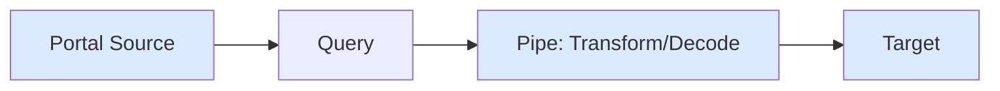
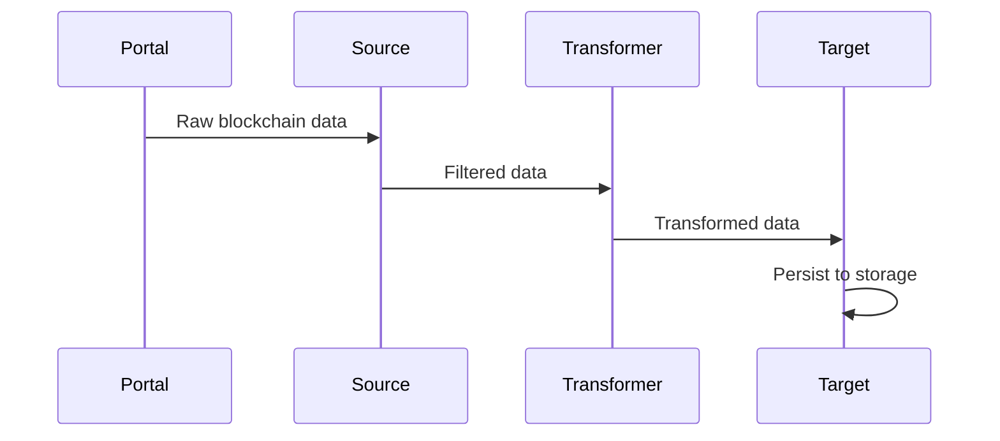

## Architecture



## Query Builder

Build queries using `EvmQueryBuilder` class.

```ts
import { EvmQueryBuilder } from "@sqd-pipes/pipes/evm";

const query = new EvmQueryBuilder()
  .addFields({
    block: { number: true, hash: true }, // required
    log: { address: true, topics: true, data: true },
  })
  .addLog({
    request: {
      address: ["0xa0b86991c6218b36c1d19d4a2e9eb0ce3606eb48"],
      topic0: [
        "0xddf252ad1be2c89b69c2b068fc378daa952ba7f163c4a11628f55a4df523b3ef",
      ],
    },
    range: { from: 20000000, to: 20000100 },
  });
```

### Methods

- **addFields**: Select which fields to return (must include `block.number` and `block.hash`)
- **addLog**: Filter event logs by address and topics
- **addTransaction**: Filter transactions by from/to addresses
- **addTrace**: Filter traces by call parameters

### Field Selection

Only request fields you need:

```ts
.addFields({
  block: {
    number: true,
    hash: true,
    timestamp: true
  },
  log: {
    address: true,
    topics: true,
    data: true,
    transactionHash: true,
    logIndex: true
  }
})
```

## Sources

Stream data from Portal API.

```ts focus={4}
import { createEvmPortalSource } from "@sqd-pipes/pipes/evm";

const source = createEvmPortalSource({
  portal: "https://portal.sqd.dev/datasets/ethereum-mainnet",
  query: queryBuilder,
  cache: {
    // optional
    adapter: await sqliteCacheAdapter({ path: "./cache.sqlite" }),
  },
});
```

### Direct Iteration

Stream data directly:

```ts
for await (const { data } of source) {
  console.log(data.blocks);
}
```

## Transformers

Transform data in pipes.

```ts
import { createTransformer } from "@sqd-pipes/pipes";

const transformer = createTransformer({
  transform: async (data) => {
    return data.blocks.map((block) => ({
      number: block.header.number,
      logCount: block.logs.length,
    }));
  },
});

await source.pipe(transformer).pipeTo(target);
```

### Dynamic Queries

Add queries from transformers:

```ts
const transformer = createTransformer({
  query: ({ queryBuilder }) => {
    queryBuilder.addLog({
      request: { address: ["0x..."] },
      range: { from: 20000000 },
    });
  },
  transform: async (data) => processData(data),
});
```

## Decoders

Decode smart contract events as a pipe.

```ts
import { createEvmDecoder, commonAbis } from "@sqd-pipes/pipes/evm";

const decoder = createEvmDecoder({
  range: { from: 20000000, to: 20100000 },
  contracts: ["0xa0b86991c6218b36c1d19d4a2e9eb0ce3606eb48"],
  events: {
    transfer: commonAbis.erc20.events.Transfer,
  },
});

await source.pipe(decoder).pipeTo(target);
```

<Tip>
You don't need a query builder when using `createEvmDecoder` or `createSolanaInstructionDecoder` - these decoders automatically build the necessary queries for you. However, you always need a portal source.
</Tip>

### Decoded Event Structure

```ts
{
  blockNumber: 20000000,
  timestamp: Date,
  contract: '0xa0b86991c6218b36c1d19d4a2e9eb0ce3606eb48',
  transactionHash: '0x...',
  rawEvent: {
    address: '0x...',
    data: '0x...',
    topics: ['0x...']
  },
  event: {
    from: '0x...',
    to: '0x...',
    value: 1000000n
  }
}
```

### Composite Decoders

Decode multiple event types:

```ts
const pipeline = source.pipeComposite({
  transfers: createEvmDecoder({
    range: { from: 20000000 },
    contracts: ["0x..."],
    events: { transfer: commonAbis.erc20.events.Transfer },
  }),
  swaps: createEvmDecoder({
    range: { from: 20000000 },
    contracts: ["0x..."],
    events: { swap: uniswapAbi.events.Swap },
  }),
});

for await (const { data } of pipeline) {
  console.log(data.transfers.transfer); // ERC20 transfers
  console.log(data.swaps.swap); // Uniswap swaps
}
```

## Targets

Persist data to any destination.

```ts
import { createTarget } from "@sqd-pipes/pipes";

const target = createTarget({
  write: async ({ ctx: { logger, profiler }, read }) => {
    for await (const { data } of read()) {
      // Save data
      await database.insert(data);
      logger.info(`Processed ${data.length} items`);
    }
  },
});

await source.pipeTo(target);
```

<Warning>
Use finalized blocks or implement the `onRollback` handler to handle blockchain reorgs.
</Warning>

### Context

Access logger and profiler:

```ts
write: async ({ ctx, read }) => {
  const span = ctx.profiler.start("processing");
  ctx.logger.info("Starting batch");

  for await (const { data } of read()) {
    await processData(data);
  }

  span.end();
};
```

### Cursor Management

Save progress:

```ts
let lastBlock = 0;

const target = createTarget({
  write: async ({ read }) => {
    for await (const { data } of read()) {
      await database.insert(data);
      lastBlock = getLastBlockNumber(data);
      await saveCursor(lastBlock);
    }
  },
});
```

## Data Flow



## Next Steps

<CardGroup cols={2}>
  <Card
    title="Query Builder"
    icon="filter"
    href="/en/sdk/pipes-sdk/core-concepts/query-builder"
  >
    Build queries
  </Card>

{" "}

<Card
  title="Transformers"
  icon="wand-magic-sparkles"
  href="/en/sdk/pipes-sdk/core-concepts/transformers"
>
  Transform data
</Card>

{" "}

<Card
  title="Event Decoding"
  icon="code"
  href="/en/sdk/pipes-sdk/core-concepts/event-decoding"
>
  Decode events
</Card>

  <Card title="Targets" icon="bullseye" href="/en/sdk/pipes-sdk/core-concepts/targets">
    Persist data
  </Card>
</CardGroup>
