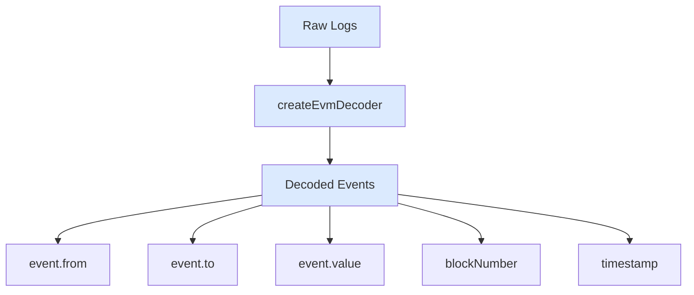

## createEvmDecoder

Decode smart contract events as a pipe.

```ts
import { createEvmDecoder, commonAbis } from "@sqd-pipes/pipes/evm";

const decoder = createEvmDecoder({
  range: { from: 20000000, to: 20100000 },
  contracts: ["0xa0b86991c6218b36c1d19d4a2e9eb0ce3606eb48"],
  events: {
    transfer: commonAbis.erc20.events.Transfer,
  },
});

await source.pipe(decoder).pipeTo(target);
```

## Configuration

### Range

Specify which blocks to decode:

```ts
// Fixed range
{ range: { from: 20000000, to: 20100000 } }

// From latest
{ range: { from: 'latest' } }

// From specific block
{ range: { from: 20000000 } }
```

### Contracts

Array of contract addresses:

```ts
{
  contracts: [
    "0xa0b86991c6218b36c1d19d4a2e9eb0ce3606eb48", // USDC
    "0xdac17f958d2ee523a2206206994597c13d831ec7", // USDT
    "0x6b175474e89094c44da98b954eedeac495271d0f", // DAI
  ];
}
```

### Events

Map event names to ABI objects:

```ts
{
  events: {
    transfer: commonAbis.erc20.events.Transfer,
    approval: commonAbis.erc20.events.Approval
  }
}
```

## Common ABIs

Pre-defined ABIs for standard contracts:

```ts
import { commonAbis } from "@sqd-pipes/pipes/evm";

// ERC20
commonAbis.erc20.events.Transfer;
commonAbis.erc20.events.Approval;

// ERC721
commonAbis.erc721.events.Transfer;
commonAbis.erc721.events.Approval;
commonAbis.erc721.events.ApprovalForAll;
```

## Custom ABIs

Generate ABIs from contract JSON:

```bash
npx @subsquid/evm-typegen src/abi abi/uniswapV3Pool.json
```

<Tip>
Using `@subsquid/evm-typegen` provides full type safety for your event data and eliminates the need to manually look up raw event signatures (topic0 hashes). The generated types ensure compile-time safety when accessing event fields.
</Tip>

Use generated ABIs:

```ts
import * as uniswapAbi from "./abi/uniswapV3Pool";

const decoder = createEvmDecoder({
  range: { from: 12369621 },
  contracts: ["0x..."],
  events: {
    swap: uniswapAbi.events.Swap,
    mint: uniswapAbi.events.Mint,
    burn: uniswapAbi.events.Burn,
  },
});
```

<Note>
The property names in the `events` object (like `swap`, `mint`, `burn`) are arbitrary. You can use any names you prefer—these are just labels that help you organize and access the decoded events in your code.
</Note>

## Decoded Event Structure

```ts
{
  blockNumber: 20000000,
  timestamp: Date,
  contract: '0xa0b86991c6218b36c1d19d4a2e9eb0ce3606eb48',
  transactionHash: '0x...',
  logIndex: 123,
  rawEvent: {
    address: '0x...',
    data: '0x...',
    topics: ['0x...']
  },
  event: {
    from: '0x742d35Cc6634C0532925a3b844Bc9e7595f0bEb',
    to: '0x8e23Ee67d1332aD560396262C48ffbB273f626a4',
    value: 1000000n
  }
}
```

Access decoded data:

```ts
for await (const { data } of source.pipe(decoder)) {
  for (const transfer of data.transfer) {
    console.log(transfer.event.from);
    console.log(transfer.event.to);
    console.log(transfer.event.value);
    console.log(transfer.blockNumber);
    console.log(transfer.timestamp);
  }
}
```

## Multiple Event Types

Decode multiple events from same contract:

```ts
const decoder = createEvmDecoder({
  range: { from: 20000000 },
  contracts: ["0xa0b86991c6218b36c1d19d4a2e9eb0ce3606eb48"],
  events: {
    transfer: commonAbis.erc20.events.Transfer,
    approval: commonAbis.erc20.events.Approval,
  },
});

for await (const { data } of source.pipe(decoder)) {
  console.log(`Transfers: ${data.transfer.length}`);
  console.log(`Approvals: ${data.approval.length}`);
}
```

## Composite Decoders

Decode from multiple contracts simultaneously:

```ts
const pipeline = source.pipeComposite({
  usdc: createEvmDecoder({
    range: { from: 20000000 },
    contracts: ["0xa0b86991c6218b36c1d19d4a2e9eb0ce3606eb48"],
    events: { transfer: commonAbis.erc20.events.Transfer },
  }),
  usdt: createEvmDecoder({
    range: { from: 20000000 },
    contracts: ["0xdac17f958d2ee523a2206206994597c13d831ec7"],
    events: { transfer: commonAbis.erc20.events.Transfer },
  }),
});

for await (const { data } of pipeline) {
  console.log(`USDC: ${data.usdc.transfer.length}`);
  console.log(`USDT: ${data.usdt.transfer.length}`);
}
```

## Profiler Integration

```ts
const decoder = createEvmDecoder({
  profiler: { id: "ERC20 decoding" },
  range: { from: 20000000 },
  contracts: ["0x..."],
  events: { transfer: commonAbis.erc20.events.Transfer },
});
```

## Data Flow



## Complete Example

```ts expandable
import {
  createEvmPortalSource,
  createEvmDecoder,
  commonAbis,
} from "@sqd-pipes/pipes/evm";
import { createTarget } from "@sqd-pipes/pipes";

const source = createEvmPortalSource({
  portal: "https://portal.sqd.dev/datasets/ethereum-mainnet",
});

const decoder = createEvmDecoder({
  range: { from: 20000000, to: 20000100 },
  contracts: ["0xa0b86991c6218b36c1d19d4a2e9eb0ce3606eb48"],
  events: {
    transfer: commonAbis.erc20.events.Transfer,
  },
});

const target = createTarget({
  write: async ({ ctx: { logger }, read }) => {
    for await (const { data } of read()) {
      for (const transfer of data.transfer) {
        logger.info({
          from: transfer.event.from,
          to: transfer.event.to,
          amount: transfer.event.value.toString(),
          block: transfer.blockNumber,
        });
      }
    }
  },
});

await source.pipe(decoder).pipeTo(target);
```

## Next Steps

<CardGroup cols={2}>
  <Card title="Targets" icon="bullseye" href="/en/sdk/pipes-sdk/core-concepts/targets">
    Persist decoded data
  </Card>

{" "}

<Card
  title="ClickHouse"
  href="/en/sdk/pipes-sdk/integration-advanced/clickhouse-integration"
>
  Save to ClickHouse
</Card>

{" "}

<Card
  title="Examples"
  icon="lightbulb"
  href="/en/sdk/pipes-sdk/examples/event-decoding"
>
  See decoding examples
</Card>

  <Card title="Reference" icon="book" href="/en/sdk/pipes-sdk/reference/reference">
    Full API reference
  </Card>
</CardGroup>
