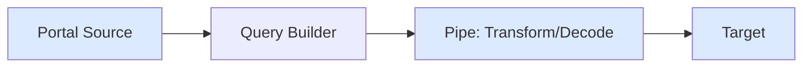

## What is Pipes SDK

TypeScript library for building data pipes. Stream blockchain data from Portal API, transform it, and persist to any target.

## Architecture



## Core Components

### Query Builder

Build queries using `EvmQueryBuilder`. Add fields, filters, and ranges.

```ts
const query = new EvmQueryBuilder()
  .addFields({ block: { number: true, hash: true } })
  .addLog({ request: { address: ["0x..."] }, range: { from: 20_000_000 } });
```

### Source

Stream data from Portal API.

```ts
const source = createEvmPortalSource({
  portal: "https://portal.sqd.dev/datasets/ethereum-mainnet",
  query,
});
```

### Transformer

Transform data in pipes.

```ts
const transformer = createTransformer({
  transform: async (data) => data.blocks.map((b) => b.logs),
});
```

### Decoder

Decode smart contract events.

```ts
const decoder = createEvmDecoder({
  range: { from: 20_000_000 },
  contracts: ["0x..."],
  events: { transfer: commonAbis.erc20.events.Transfer },
});
```

### Target

Persist data to any destination.

```ts
const target = createTarget({
  write: async ({ ctx, read }) => {
    for await (const { data } of read()) {
      await database.save(data);
    }
  },
});
```

## Pipes vs Squid SDK

| Feature     | Pipes SDK       | Squid SDK       |
| ----------- | --------------- | --------------- |
| API         | Streaming pipes | Batch processor |
| Database    | Any (DIY)       | TypeORM         |
| GraphQL     | Manual          | Auto-generated  |
| Flexibility | Maximum         | Structured      |
| Setup       | Minimal         | Full stack      |
| Best for    | Custom pipes    | Production APIs |

## Next Steps

<CardGroup cols={2}>
  <Card title="Quickstart" icon="rocket" href="/en/sdk/pipes-sdk/quickstart">
    Build a pipe in 5 minutes
  </Card>

{" "}

<Card
  title="Core Concepts"
  icon="book"
  href="/en/sdk/pipes-sdk/core-concepts/core-concepts"
>
  Learn the architecture
</Card>

  <Card
    title="Examples"
    icon="code"
    href="/en/sdk/pipes-sdk/examples/getting-started"
  >
    View code examples
  </Card>
</CardGroup>
