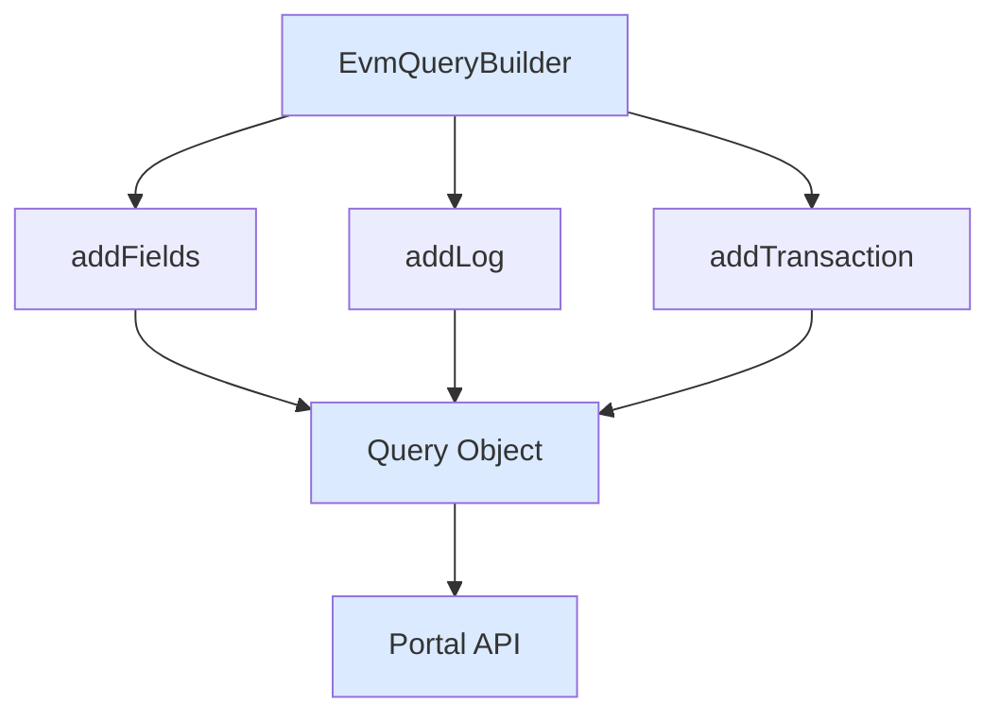

## EvmQueryBuilder

Fluent API for building queries.

```ts
import { EvmQueryBuilder } from "@sqd-pipes/pipes/evm";

const query = new EvmQueryBuilder()
  .addFields({
    block: { number: true, hash: true },
    log: { address: true, topics: true, data: true },
  })
  .addLog({
    request: { address: ["0x..."] },
    range: { from: 20000000 },
  });
```

## Required Fields

Must include `block.number` and `block.hash`:

```ts
.addFields({
  block: {
    number: true, // required
    hash: true,   // required
  }
})
```

## Select Fields

### Block Fields

```ts
.addFields({
  block: {
    number: true,
    hash: true,
    parentHash: true,
    timestamp: true,
    size: true,
    gasUsed: true,
    gasLimit: true,
    baseFeePerGas: true
  }
})
```

### Log Fields

```ts
.addFields({
  log: {
    address: true,
    data: true,
    topics: true,
    transactionHash: true,
    transactionIndex: true,
    logIndex: true,
    removed: true
  }
})
```

### Transaction Fields

```ts
.addFields({
  transaction: {
    hash: true,
    from: true,
    to: true,
    value: true,
    input: true,
    gas: true,
    gasPrice: true,
    maxFeePerGas: true,
    maxPriorityFeePerGas: true,
    nonce: true
  }
})
```

## Filter Logs

```ts
.addLog({
  request: {
    address: ['0xa0b86991c6218b36c1d19d4a2e9eb0ce3606eb48'],
    topic0: ['0xddf252ad1be2c89b69c2b068fc378daa952ba7f163c4a11628f55a4df523b3ef'],
    topic1: ['0x000000000000000000000000...'], // optional
  },
  range: {
    from: 20000000,
    to: 20000100
  }
})
```

### Multiple Contracts

```ts
.addLog({
  request: {
    address: [
      '0xa0b86991c6218b36c1d19d4a2e9eb0ce3606eb48', // USDC
      '0xdac17f958d2ee523a2206206994597c13d831ec7', // USDT
      '0x6b175474e89094c44da98b954eedeac495271d0f'  // DAI
    ]
  },
  range: { from: 20000000 }
})
```

### Multiple Event Types

```ts
.addLog({
  request: {
    address: ['0x...'],
    topic0: [
      '0xddf252ad1be2c89b69c2b068fc378daa952ba7f163c4a11628f55a4df523b3ef', // Transfer
      '0x8c5be1e5ebec7d5bd14f71427d1e84f3dd0314c0f7b2291e5b200ac8c7c3b925'  // Approval
    ]
  },
  range: { from: 20000000 }
})
```

## Filter Transactions

```ts
.addTransaction({
  request: {
    from: ['0x...'],
    to: ['0x...'],
    sighash: ['0xa9059cbb'] // function selector
  },
  range: { from: 20000000 }
})
```

## Static vs Dynamic Queries

### Static Query (in Source)

```ts
const query = new EvmQueryBuilder()
  .addFields({ block: { number: true, hash: true } })
  .addLog({
    request: { address: ["0x..."] },
    range: { from: 20000000 },
  });

const source = createEvmPortalSource({
  portal: "https://portal.sqd.dev/datasets/ethereum-mainnet",
  query,
});
```

### Dynamic Query (in Transformer)

```ts
// Start with minimal query
const source = createEvmPortalSource({
  portal: "https://portal.sqd.dev/datasets/ethereum-mainnet",
  query: new EvmQueryBuilder(), // empty
});

// Transformer adds to the query
const transformer = createTransformer({
  query: ({ queryBuilder }) => {
    queryBuilder
      .addFields({
        block: { number: true, hash: true },
        log: { address: true, topics: true, data: true },
      })
      .addLog({
        request: { address: ["0x..."] },
        range: { from: 20000000 },
      });
  },
  transform: async (data) => processData(data),
});

await source.pipe(transformer).pipeTo(target);
```

## Query Flow



## Best Practices

### Only Request What You Need

```ts
// BAD - requests everything
.addFields({
  block: { /* all fields */ },
  log: { /* all fields */ },
  transaction: { /* all fields */ }
})

// GOOD - requests only necessary fields
.addFields({
  block: { number: true, hash: true },
  log: { address: true, topics: true, data: true, transactionHash: true }
})
```

### Use Specific Filters

```ts
// BAD - no filtering
.addLog({ range: { from: 20000000 } })

// GOOD - filter by address and topic
.addLog({
  request: {
    address: ['0x...'],
    topic0: ['0x...']
  },
  range: { from: 20000000 }
})
```

## Next Steps

<CardGroup cols={2}>
  <Card
    title="Transformers"
    icon="wand-magic-sparkles"
    href="/en/sdk/pipes-sdk/core-concepts/transformers"
  >
    Transform data
  </Card>

{" "}

<Card
  title="Event Decoding"
  icon="code"
  href="/en/sdk/pipes-sdk/core-concepts/event-decoding"
>
  Decode events
</Card>

{" "}

<Card
  title="Examples"
  icon="lightbulb"
  href="/en/sdk/pipes-sdk/examples/getting-started"
>
  See query examples
</Card>

  <Card title="Reference" icon="book" href="/en/sdk/pipes-sdk/reference/reference">
    Full API reference
  </Card>
</CardGroup>
