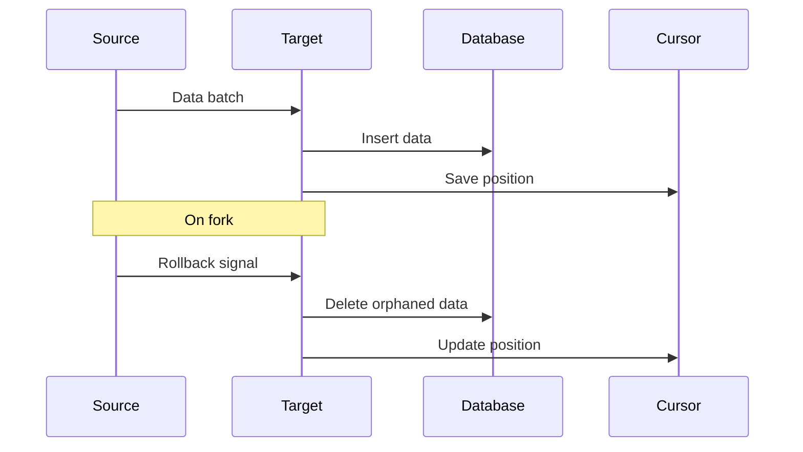

## createTarget

Persist data to any destination.

```ts
import { createTarget } from "@sqd-pipes/pipes";

const target = createTarget({
  write: async ({ ctx: { logger, profiler }, read }) => {
    for await (const { data } of read()) {
      await database.save(data);
      logger.info(`Saved ${data.length} items`);
    }
  },
});

await source.pipeTo(target);
```

<Warning>
  Use finalized blocks or implement the `onRollback` handler to handle
  blockchain reorgs.
</Warning>

## Write Function

```ts
write: async ({ ctx, read }) => {
  for await (const { data } of read()) {
    // Process data
  }
};
```

### Context

Access logger and profiler:

```ts
write: async ({ ctx: { logger, profiler }, read }) => {
  const span = profiler.start("processing");
  logger.info("Starting batch");

  for await (const { data } of read()) {
    await processData(data);
  }

  span.end();
};
```

Process batches with context:

```ts
write: async ({ ctx: { logger, profiler }, read }) => {
  for await (const { data } of read()) {
    const span = profiler.start("batch");
    logger.info("Processing batch");

    const processedBlocks = data.blocks.map((block) => {
      // Process each block
      return {
        number: block.header.number,
        timestamp: block.header.timestamp,
        txCount: block.transactions.length,
      };
    });

    await database.insert(processedBlocks);
    span.end();
  }
};
```

### Context in Transformers

Context is also available in transform functions as the second parameter:

```ts
const transformer = createTransformer({
  transform: async (data, { ctx: { logger, profiler } }) => {
    const span = profiler.start("batch");
    logger.info("Processing batch");

    const processedBlocks = data.blocks.map((block) => {
      // Transform block data
      return {
        number: block.header.number,
        timestamp: block.header.timestamp,
        logCount: block.logs.length,
      };
    });

    span.end();
    return processedBlocks;
  },
});
```

### Read Iterator

Stream data batches:

```ts
write: async ({ read }) => {
  for await (const { data } of read()) {
    console.log(data);
  }
};
```

## Cursor Management

Save progress to resume from last processed block.

```ts
let lastBlock = 0;

const target = createTarget({
  write: async ({ read }) => {
    for await (const { data } of read()) {
      // Save data
      await database.insert(data);

      // Update cursor
      lastBlock = getLastBlockNumber(data);
      await fs.writeFile("cursor.json", JSON.stringify({ block: lastBlock }));
    }
  },
});
```

### Resume from Cursor

```ts
// Load saved cursor
const cursor = JSON.parse(await fs.readFile("cursor.json", "utf-8"));

// Start source from cursor
const source = createEvmPortalSource({
  portal: "https://portal.sqd.dev/datasets/ethereum-mainnet",
  query: queryBuilder,
  cursor: { blockNumber: cursor.block },
});
```

## Fork Handling

Handle blockchain reorganizations.

```ts
const target = createTarget({
  write: async ({ read }) => {
    for await (const { data } of read()) {
      await database.insert(data);
    }
  },
  onRollback: async ({ cursor }) => {
    // Delete data after fork point
    await database.query("DELETE FROM transfers WHERE block_number > $1", [
      cursor.blockNumber,
    ]);
  },
});
```

### Fork Detection

Targets receive rollback signals:

```ts
onRollback: async ({ cursor, type }) => {
  console.log(`Fork detected at block ${cursor.blockNumber}`);
  console.log(`Rollback type: ${type}`);

  // Remove orphaned data
  await removeDataAfter(cursor.blockNumber);

  // Update cursor
  await saveCursor(cursor.blockNumber);
};
```

## Complete Example

```ts expandable
import { createTarget } from "@sqd-pipes/pipes";
import {
  createEvmPortalSource,
  createEvmDecoder,
  commonAbis,
} from "@sqd-pipes/pipes/evm";
import fs from "fs/promises";

const CURSOR_FILE = "cursor.json";

async function loadCursor() {
  try {
    const data = await fs.readFile(CURSOR_FILE, "utf-8");
    return JSON.parse(data);
  } catch {
    return null;
  }
}

async function saveCursor(blockNumber: number) {
  await fs.writeFile(CURSOR_FILE, JSON.stringify({ blockNumber }));
}

const cursor = await loadCursor();

const source = createEvmPortalSource({
  portal: "https://portal.sqd.dev/datasets/ethereum-mainnet",
  cursor: cursor ? { blockNumber: cursor.blockNumber } : undefined,
});

const decoder = createEvmDecoder({
  range: { from: cursor?.blockNumber || 20000000 },
  contracts: ["0xa0b86991c6218b36c1d19d4a2e9eb0ce3606eb48"],
  events: { transfer: commonAbis.erc20.events.Transfer },
});

const target = createTarget({
  write: async ({ ctx: { logger }, read }) => {
    for await (const { data } of read()) {
      // Save transfers
      await database.insert(data.transfer);

      // Update cursor
      const lastBlock = Math.max(...data.transfer.map((t) => t.blockNumber));
      await saveCursor(lastBlock);

      logger.info(`Processed up to block ${lastBlock}`);
    }
  },
  onRollback: async ({ cursor }) => {
    logger.warn(`Fork at block ${cursor.blockNumber}`);
    await database.query("DELETE FROM transfers WHERE block_number > $1", [
      cursor.blockNumber,
    ]);
    await saveCursor(cursor.blockNumber);
  },
});

await source.pipe(decoder).pipeTo(target);
```

## Patterns

### Console Logging

```ts
const target = createTarget({
  write: async ({ read }) => {
    for await (const { data } of read()) {
      console.log(JSON.stringify(data, null, 2));
    }
  },
});
```

### File Output

```ts
const target = createTarget({
  write: async ({ read }) => {
    for await (const { data } of read()) {
      const filename = `data-${Date.now()}.json`;
      await fs.writeFile(filename, JSON.stringify(data));
    }
  },
});
```

### Database Insert

```ts
const target = createTarget({
  write: async ({ read }) => {
    for await (const { data } of read()) {
      await database.transaction(async (tx) => {
        for (const item of data.transfer) {
          await tx.insert("transfers", {
            block_number: item.blockNumber,
            from_address: item.event.from,
            to_address: item.event.to,
            value: item.event.value.toString(),
          });
        }
      });
    }
  },
});
```

## Data Flow



## Next Steps

<CardGroup cols={2}>
  <Card
    title="ClickHouse"
   
    href="/en/sdk/pipes-sdk/integration-advanced/clickhouse-integration"
  >
    ClickHouse integration
  </Card>

{" "}

<Card
  title="Examples"
  icon="lightbulb"
  href="/en/sdk/pipes-sdk/examples/data-persistence"
>
  Persistence examples
</Card>

{" "}

<Card
  title="Advanced"
  icon="rocket"
  href="/en/sdk/pipes-sdk/integration-advanced/advanced-patterns"
>
  Advanced patterns
</Card>

  <Card title="Reference" icon="book" href="/en/sdk/pipes-sdk/reference/reference">
    Full API reference
  </Card>
</CardGroup>
