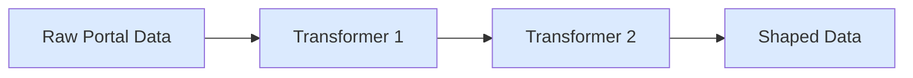

## createTransformer

Transform data as it flows through pipes.

```ts
import { createTransformer } from "@sqd-pipes/pipes";
import type { EvmPortalData } from "@sqd-pipes/pipes/evm";

const transformer = createTransformer({
  transform: async (data: EvmPortalData<any>) => {
    return data.blocks.map((block) => ({
      number: block.header.number,
      hash: block.header.hash,
      logCount: block.logs.length,
    }));
  },
});

await source.pipe(transformer).pipeTo(target);
```

## Transform Function

```ts
transform: async (data: EvmPortalData<any>) => Promise<any>;
```

Access blocks and logs:

```ts
transform: async (data) => {
  return data.blocks.flatMap((block) =>
    block.logs.map((log) => ({
      blockNumber: block.header.number,
      transactionHash: log.transactionHash,
      address: log.address,
    }))
  );
};
```

## Query Callback

Add queries dynamically:

```ts
const transformer = createTransformer({
  query: ({ queryBuilder, portal, logger }) => {
    queryBuilder
      .addFields({
        block: { number: true, hash: true },
        log: { address: true, topics: true, data: true },
      })
      .addLog({
        request: { address: ["0x..."] },
        range: { from: 20000000 },
      });
  },
  transform: async (data) => processData(data),
});
```

### Self-Contained Transformers

```ts
// Start with empty query in source
const source = createEvmPortalSource({
  portal: "https://portal.sqd.dev/datasets/ethereum-mainnet",
  query: new EvmQueryBuilder(),
});

// Transformer specifies its own data requirements
const usdcTransformer = createTransformer({
  query: ({ queryBuilder }) => {
    queryBuilder
      .addFields({
        block: { number: true, hash: true },
        log: { address: true, topics: true, data: true, transactionHash: true },
      })
      .addLog({
        request: {
          address: ["0xa0b86991c6218b36c1d19d4a2e9eb0ce3606eb48"],
          topic0: [
            "0xddf252ad1be2c89b69c2b068fc378daa952ba7f163c4a11628f55a4df523b3ef",
          ],
        },
        range: { from: 20000000, to: 20000000 },
      });
  },
  transform: async (data) => {
    return data.blocks.map((b) => b.logs.map((l) => l.transactionHash));
  },
});

await source.pipe(usdcTransformer).pipeTo(target);
```

## Patterns

### Extract Fields

```ts
transform: async (data) => {
  return data.blocks.map((block) => ({
    number: block.header.number,
    timestamp: block.header.timestamp,
    transactions: block.logs.map((log) => log.transactionHash),
  }));
};
```

### Filter Data

```ts
transform: async (data) => {
  return data.blocks.filter((block) => block.logs.length > 10);
};
```

### Aggregate

```ts
transform: async (data) => {
  const logCount = data.blocks.reduce(
    (sum, block) => sum + block.logs.length,
    0
  );
  return { totalLogs: logCount };
};
```

### Flatten

```ts
transform: async (data) => {
  return data.blocks.flatMap((block) => block.logs);
};
```

## Chaining Transformers

```ts
const extract = createTransformer({
  transform: async (data) => data.blocks.map((b) => b.logs),
});

const flatten = createTransformer({
  transform: async (data) => data.flat(),
});

await source.pipe(extract).pipe(flatten).pipeTo(target);
```

## Data Flow



## Context Access

```ts
const transformer = createTransformer({
  transform: async (data, { ctx: { logger, profiler } }) => {
    const span = profiler.start("transform");
    logger.info(`Processing ${data.blocks.length} blocks`);

    const result = processData(data);

    span.end();
    return result;
  },
});
```

## Next Steps

<CardGroup cols={2}>
  <Card
    title="Event Decoding"
    icon="code"
    href="/en/sdk/pipes-sdk/core-concepts/event-decoding"
  >
    Decode smart contract events
  </Card>

{" "}

<Card
  title="Targets"
  icon="bullseye"
  href="/en/sdk/pipes-sdk/core-concepts/targets"
>
  Persist transformed data
</Card>

{" "}

<Card
  title="Examples"
  icon="lightbulb"
  href="/en/sdk/pipes-sdk/examples/getting-started"
>
  See transformer examples
</Card>

  <Card title="Reference" icon="book" href="/en/sdk/pipes-sdk/reference/reference">
    Full API reference
  </Card>
</CardGroup>
