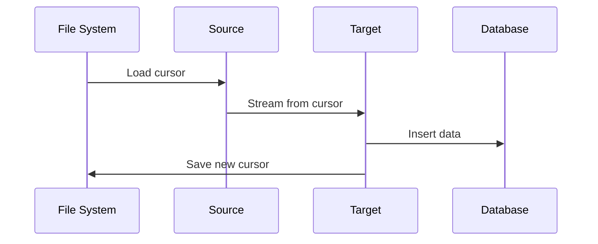
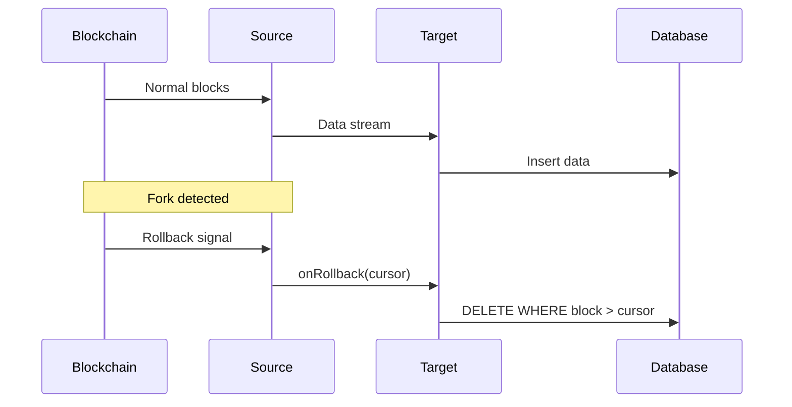
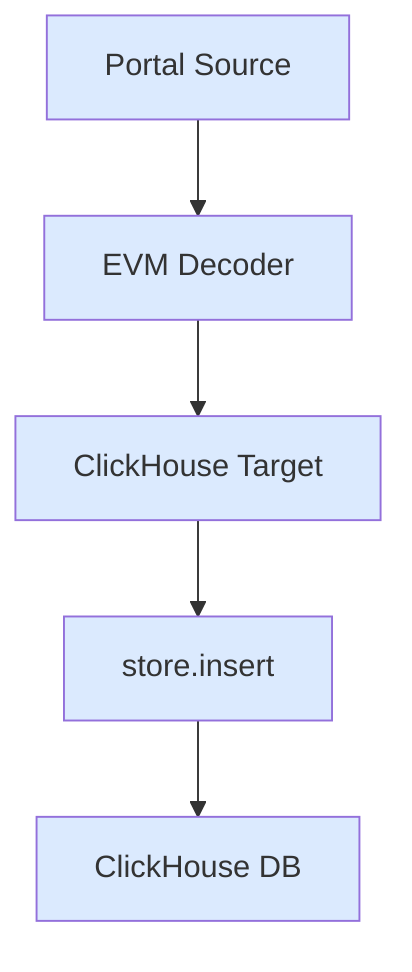

## Cursor Management

Save progress to resume from last processed block.

**Use case**: Resume indexing after restart without re-processing data.

```ts expandable
import { createTarget } from "@sqd-pipes/pipes";
import {
  createEvmPortalSource,
  createEvmDecoder,
  commonAbis,
} from "@sqd-pipes/pipes/evm";
import fs from "fs/promises";

const CURSOR_FILE = "cursor.json";

async function loadCursor() {
  try {
    const data = await fs.readFile(CURSOR_FILE, "utf-8");
    return JSON.parse(data);
  } catch {
    return null;
  }
}

async function saveCursor(blockNumber: number) {
  await fs.writeFile(CURSOR_FILE, JSON.stringify({ blockNumber }));
}

// Load saved cursor
const cursor = await loadCursor();

const source = createEvmPortalSource({
  portal: "https://portal.sqd.dev/datasets/ethereum-mainnet",
  cursor: cursor ? { blockNumber: cursor.blockNumber } : undefined,
});

const decoder = createEvmDecoder({
  range: { from: cursor?.blockNumber || 20000000 },
  contracts: ["0xa0b86991c6218b36c1d19d4a2e9eb0ce3606eb48"],
  events: { transfer: commonAbis.erc20.events.Transfer },
});

const target = createTarget({
  write: async ({ ctx: { logger }, read }) => {
    for await (const { data } of read()) {
      // Process data
      await database.insert(data.transfer);

      // Save cursor
      const lastBlock = Math.max(...data.transfer.map((t) => t.blockNumber));
      await saveCursor(lastBlock);

      logger.info(`Processed up to block ${lastBlock}`);
    }
  },
});

await source.pipe(decoder).pipeTo(target);
```

### Data Flow



## Fork Handling

Handle blockchain reorganizations.

**Use case**: Automatically handle chain forks and rollbacks.

```ts expandable
import { createTarget } from "@sqd-pipes/pipes";
import {
  createEvmPortalSource,
  createEvmDecoder,
  commonAbis,
} from "@sqd-pipes/pipes/evm";

const source = createEvmPortalSource({
  portal: "https://portal.sqd.dev/datasets/ethereum-mainnet",
});

const decoder = createEvmDecoder({
  range: { from: "latest" },
  contracts: ["0xa0b86991c6218b36c1d19d4a2e9eb0ce3606eb48"],
  events: { transfer: commonAbis.erc20.events.Transfer },
});

const target = createTarget({
  write: async ({ ctx: { logger }, read }) => {
    for await (const { data } of read()) {
      // Insert transfers
      await database.query(
        "INSERT INTO transfers (block_number, from_address, to_address, value) VALUES ($1, $2, $3, $4)",
        data.transfer.map((t) => [
          t.blockNumber,
          t.event.from,
          t.event.to,
          t.event.value.toString(),
        ])
      );

      logger.info(`Inserted ${data.transfer.length} transfers`);
    }
  },
  onRollback: async ({ cursor }) => {
    logger.warn(`Fork detected at block ${cursor.blockNumber}`);

    // Delete orphaned data
    await database.query("DELETE FROM transfers WHERE block_number > $1", [
      cursor.blockNumber,
    ]);

    logger.info(`Rolled back to block ${cursor.blockNumber}`);
  },
});

await source.pipe(decoder).pipeTo(target);
```

### Data Flow



## ClickHouse Target

Persist to ClickHouse with automatic fork handling.

**Use case**: Production-ready persistence with ClickHouse.

```ts expandable
import { createClient } from "@clickhouse/client";
import {
  createEvmPortalSource,
  createEvmDecoder,
  commonAbis,
} from "@sqd-pipes/pipes/evm";
import { createClickhouseTarget } from "@sqd-pipes/pipes/targets/clickhouse";

// Create client
const client = createClient({
  username: "default",
  password: "default",
  url: "http://localhost:8123",
});

// Create table
await client.command({
  query: `
    CREATE TABLE IF NOT EXISTS usdc_transfers (
      block_number UInt32 CODEC (DoubleDelta, ZSTD),
      timestamp DateTime CODEC (DoubleDelta, ZSTD),
      transaction_hash String,
      log_index UInt16,
      from_address LowCardinality(FixedString(42)),
      to_address LowCardinality(FixedString(42)),
      value UInt256,
      sign Int8 DEFAULT 1
    )
    ENGINE = CollapsingMergeTree(sign)
    ORDER BY (block_number, transaction_hash, log_index)
  `,
});

const source = createEvmPortalSource({
  portal: "https://portal.sqd.dev/datasets/ethereum-mainnet",
});

const decoder = createEvmDecoder({
  range: { from: "latest" },
  contracts: ["0xa0b86991c6218b36c1d19d4a2e9eb0ce3606eb48"],
  events: { transfer: commonAbis.erc20.events.Transfer },
});

const target = createClickhouseTarget({
  client,
  onData: async ({ store, data, ctx }) => {
    ctx.logger.info(`Inserting ${data.transfer.length} transfers`);

    store.insert({
      table: "usdc_transfers",
      values: data.transfer.map((t) => ({
        block_number: t.blockNumber,
        timestamp: t.timestamp.valueOf() / 1000,
        transaction_hash: t.transactionHash,
        log_index: t.rawEvent.logIndex,
        from_address: t.event.from,
        to_address: t.event.to,
        value: t.event.value.toString(),
      })),
      format: "JSONEachRow",
    });
  },
  onRollback: async ({ store, cursor }) => {
    await store.removeAllRows({
      tables: ["usdc_transfers"],
      where: `block_number > ${cursor.number}`,
    });
  },
});

await source.pipe(decoder).pipeTo(target);
```

### Data Flow



## File Output

Save data to JSON files.

**Use case**: Simple file-based persistence for development.

```ts
import { createTarget } from "@sqd-pipes/pipes";
import {
  createEvmPortalSource,
  createEvmDecoder,
  commonAbis,
} from "@sqd-pipes/pipes/evm";
import fs from "fs/promises";

const source = createEvmPortalSource({
  portal: "https://portal.sqd.dev/datasets/ethereum-mainnet",
});

const decoder = createEvmDecoder({
  range: { from: 20000000, to: 20000100 },
  contracts: ["0xa0b86991c6218b36c1d19d4a2e9eb0ce3606eb48"],
  events: { transfer: commonAbis.erc20.events.Transfer },
});

const target = createTarget({
  write: async ({ ctx: { logger }, read }) => {
    for await (const { data } of read()) {
      const filename = `transfers-${Date.now()}.json`;

      const simplified = data.transfer.map((t) => ({
        block: t.blockNumber,
        from: t.event.from,
        to: t.event.to,
        value: t.event.value.toString(),
      }));

      await fs.writeFile(filename, JSON.stringify(simplified, null, 2));

      logger.info(`Saved ${data.transfer.length} transfers to ${filename}`);
    }
  },
});

await source.pipe(decoder).pipeTo(target);
```

## Next Steps

<CardGroup cols={2}>
  <Card
    title="Factory Pattern"
    icon="industry"
    href="/en/sdk/pipes-sdk/examples/factory-pattern"
  >
    Dynamic contract indexing
  </Card>

{" "}

<Card
  title="Performance"
  icon="rocket"
  href="/en/sdk/pipes-sdk/examples/performance"
>
  Optimization techniques
</Card>

{" "}

<Card
  title="ClickHouse Guide"
  href="/en/sdk/pipes-sdk/integration-advanced/clickhouse-integration"
>
  ClickHouse integration
</Card>

  <Card title="Targets Guide" icon="bullseye" href="/en/sdk/pipes-sdk/core-concepts/targets">
    Learn about targets
  </Card>
</CardGroup>
