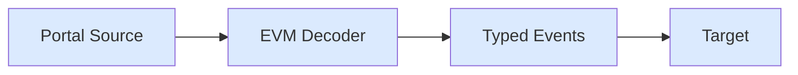
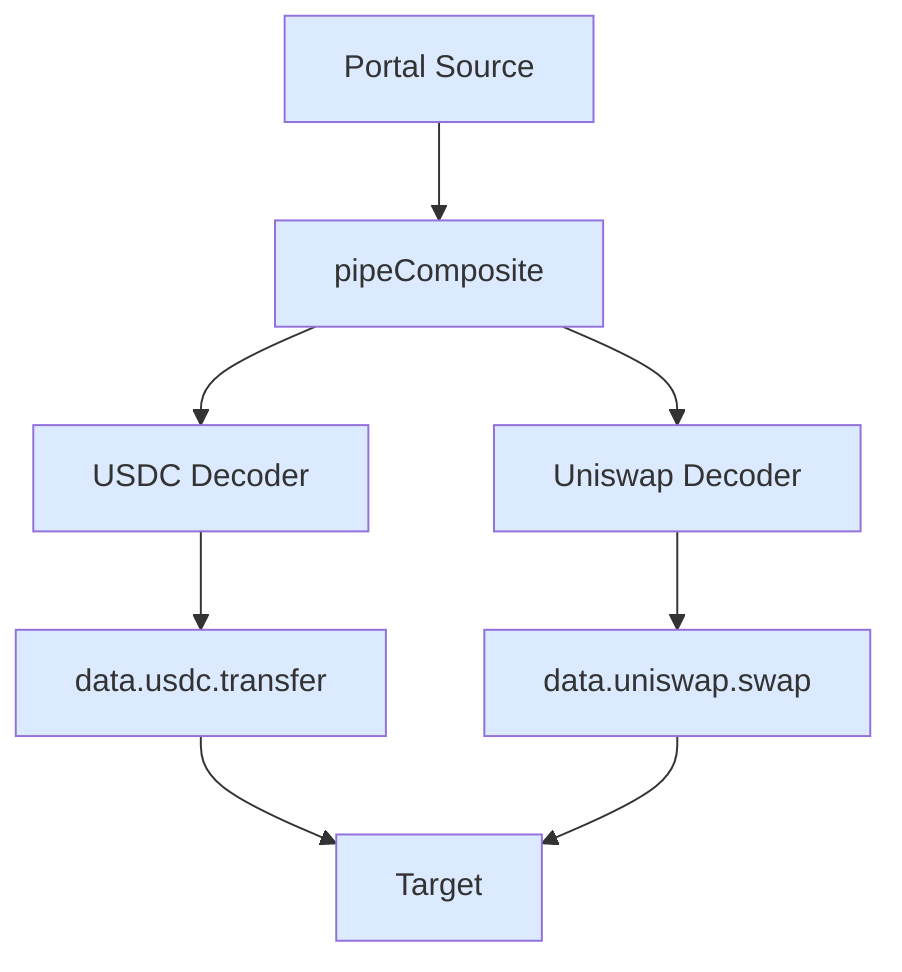

## ERC20 Decoder

Decode USDC Transfer events.

**Use case**: Decode ERC20 token transfers with typed event data.

```ts
import { createTarget } from "@sqd-pipes/pipes";
import {
  createEvmPortalSource,
  createEvmDecoder,
  commonAbis,
} from "@sqd-pipes/pipes/evm";

const source = createEvmPortalSource({
  portal: "https://portal.sqd.dev/datasets/ethereum-mainnet",
});

const decoder = createEvmDecoder({
  range: { from: 20000000, to: 20000100 },
  contracts: ["0xa0b86991c6218b36c1d19d4a2e9eb0ce3606eb48"], // USDC
  events: {
    transfer: commonAbis.erc20.events.Transfer,
  },
});

const target = createTarget({
  write: async ({ ctx: { logger }, read }) => {
    for await (const { data } of read()) {
      for (const t of data.transfer) {
        logger.info({
          from: t.event.from,
          to: t.event.to,
          value: t.event.value.toString(),
          block: t.blockNumber,
          tx: t.transactionHash,
        });
      }
    }
  },
});

await source.pipe(decoder).pipeTo(target);
```

### Data Flow



## Composite Decoder

Decode multiple event types simultaneously.

**Use case**: Index ERC20 transfers and Uniswap swaps in one pipe.

```ts expandable
import { createTarget } from "@sqd-pipes/pipes";
import {
  createEvmPortalSource,
  createEvmDecoder,
  commonAbis,
} from "@sqd-pipes/pipes/evm";
import * as uniswapAbi from "./abi/uniswap-v3-pool";

const source = createEvmPortalSource({
  portal: "https://portal.sqd.dev/datasets/ethereum-mainnet",
});

const pipeline = source.pipeComposite({
  usdc: createEvmDecoder({
    range: { from: 20000000, to: 20000100 },
    contracts: ["0xa0b86991c6218b36c1d19d4a2e9eb0ce3606eb48"],
    events: {
      transfer: commonAbis.erc20.events.Transfer,
    },
  }),
  uniswap: createEvmDecoder({
    range: { from: 20000000, to: 20000100 },
    contracts: ["0x88e6a0c2ddd26feeb64f039a2c41296fcb3f5640"],
    events: {
      swap: uniswapAbi.events.Swap,
    },
  }),
});

const target = createTarget({
  write: async ({ ctx: { logger }, read }) => {
    for await (const { data } of read()) {
      logger.info({
        usdcTransfers: data.usdc.transfer.length,
        uniswapSwaps: data.uniswap.swap.length,
      });
    }
  },
});

await pipeline.pipeTo(target);
```

### Data Flow



## Multiple Event Types

Decode Transfers and Approvals from same contract.

**Use case**: Index multiple event types from one contract.

<Tip>
  Use `@subsquid/evm-typegen` to generate typed ABIs instead of manually finding
  raw event signatures. This approach provides type safety and eliminates the
  need to look up topic0 hashes. See the [Custom ABI](#custom-abi) section
  below.
</Tip>

```ts expandable
import { createTarget } from "@sqd-pipes/pipes";
import {
  createEvmPortalSource,
  createEvmDecoder,
  commonAbis,
} from "@sqd-pipes/pipes/evm";

const source = createEvmPortalSource({
  portal: "https://portal.sqd.dev/datasets/ethereum-mainnet",
});

const decoder = createEvmDecoder({
  range: { from: 20000000, to: 20000100 },
  contracts: ["0xa0b86991c6218b36c1d19d4a2e9eb0ce3606eb48"],
  events: {
    transfer: commonAbis.erc20.events.Transfer,
    approval: commonAbis.erc20.events.Approval,
  },
});

const target = createTarget({
  write: async ({ ctx: { logger }, read }) => {
    for await (const { data } of read()) {
      logger.info({
        transfers: data.transfer.length,
        approvals: data.approval.length,
      });

      for (const t of data.transfer) {
        console.log(
          `Transfer: ${t.event.from} -> ${t.event.to}: ${t.event.value}`
        );
      }

      for (const a of data.approval) {
        console.log(
          `Approval: ${a.event.owner} approved ${a.event.spender}: ${a.event.value}`
        );
      }
    }
  },
});

await source.pipe(decoder).pipeTo(target);
```

## Custom ABI

Generate and use custom ABIs.

**Use case**: Index events from contracts with custom ABIs.

### Generate ABI

```bash
npx @subsquid/evm-typegen src/abi abi/MyContract.json
```

### Use Generated ABI

```ts
import { createEvmPortalSource, createEvmDecoder } from "@sqd-pipes/pipes/evm";
import * as myContractAbi from "./abi/MyContract";

const decoder = createEvmDecoder({
  range: { from: 20000000 },
  contracts: ["0x..."],
  events: {
    myEvent: myContractAbi.events.MyCustomEvent,
    anotherEvent: myContractAbi.events.AnotherEvent,
  },
});

for await (const { data } of source.pipe(decoder)) {
  console.log(data.myEvent);
  console.log(data.anotherEvent);
}
```

## Next Steps

<CardGroup cols={2}>
  <Card
    title="Data Persistence"
   
    href="/en/sdk/pipes-sdk/examples/data-persistence"
  >
    Persist decoded data
  </Card>

{" "}

<Card
  title="Factory Pattern"
  icon="industry"
  href="/en/sdk/pipes-sdk/examples/factory-pattern"
>
  Dynamic contract indexing
</Card>

{" "}

<Card
  title="Event Decoding Guide"
  icon="book"
  href="/en/sdk/pipes-sdk/core-concepts/event-decoding"
>
  Learn event decoding
</Card>

  <Card title="Reference" icon="lightbulb" href="/en/sdk/pipes-sdk/reference/reference">
    API reference
  </Card>
</CardGroup>
