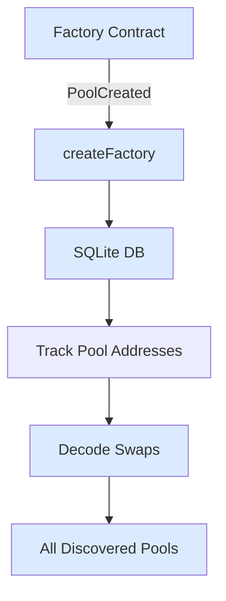
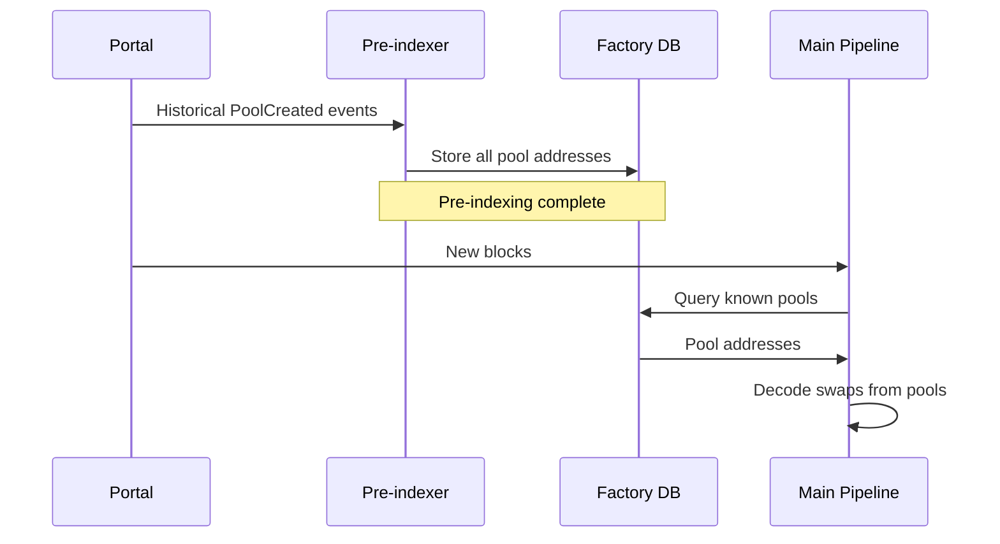

## Basic Factory

Index swaps from Uniswap V3 pools dynamically discovered via factory.

**Use case**: Track events from contracts created by a factory.

```ts
import {
  createEvmPortalSource,
  createEvmDecoder,
  createFactory,
  sqliteFactoryDatabase,
} from "@sqd-pipes/pipes/evm";
import { createTarget } from "@sqd-pipes/pipes";
import * as factoryAbi from "./abi/uniswap-v3-factory";
import * as poolAbi from "./abi/uniswap-v3-pool";

const source = createEvmPortalSource({
  portal: "https://portal.sqd.dev/datasets/ethereum-mainnet",
});

const decoder = createEvmDecoder({
  range: { from: 12369621 },
  contracts: createFactory({
    address: "0x1f98431c8ad98523631ae4a59f267346ea31f984",
    event: factoryAbi.events.PoolCreated,
    parameter: (e) => e.pool,
    database: await sqliteFactoryDatabase({
      path: "./uniswap-v3-pools.sqlite",
    }),
  }),
  events: {
    swap: poolAbi.events.Swap,
  },
});

const target = createTarget({
  write: async ({ ctx: { logger }, read }) => {
    for await (const { data } of read()) {
      logger.info(`Parsed ${data.swap.length} swaps`);
    }
  },
});

await source.pipe(decoder).pipeTo(target);
```

### How It Works



## Factory with Event Metadata

Access factory event data in decoded events.

**Use case**: Include factory context with each decoded event.

```ts expandable
import {
  createEvmPortalSource,
  createEvmDecoder,
  createFactory,
  DecodedEvent,
  sqliteFactoryDatabase,
} from "@sqd-pipes/pipes/evm";
import { createTarget } from "@sqd-pipes/pipes";
import * as factoryAbi from "./abi/uniswap-v3-factory";
import * as poolAbi from "./abi/uniswap-v3-pool";

// Transform to include factory event
function addFactoryMetadata<T, F>(event: DecodedEvent<T, F>) {
  return {
    ...event.event,
    blockNumber: event.blockNumber,
    factoryEvent: event.factory?.event,
  };
}

const source = createEvmPortalSource({
  portal: "https://portal.sqd.dev/datasets/ethereum-mainnet",
});

const decoder = createEvmDecoder({
  range: { from: 12369621 },
  contracts: createFactory({
    address: "0x1f98431c8ad98523631ae4a59f267346ea31f984",
    event: factoryAbi.events.PoolCreated,
    parameter: (e) => e.pool,
    database: await sqliteFactoryDatabase({
      path: "./uniswap-v3-pools.sqlite",
    }),
  }),
  events: {
    swap: poolAbi.events.Swap,
    mint: poolAbi.events.Mint,
  },
}).pipe(({ swap, mint }) => ({
  swap: swap.map(addFactoryMetadata),
  mint: mint.map(addFactoryMetadata),
}));

const target = createTarget({
  write: async ({ ctx: { logger }, read }) => {
    for await (const { data } of read()) {
      for (const s of data.swap) {
        logger.info({
          pool: s.factoryEvent?.pool,
          token0: s.factoryEvent?.token0,
          token1: s.factoryEvent?.token1,
          amount0: s.amount0.toString(),
          amount1: s.amount1.toString(),
        });
      }
    }
  },
});

await source.pipe(decoder).pipeTo(target);
```

## Pre-indexing Factory

Pre-populate factory database before main pipeline.

**Use case**: Discover all existing contracts before starting main indexing.

```ts expandable
import {
  createEvmPortalSource,
  createEvmDecoder,
  createFactory,
  sqliteFactoryDatabase,
} from "@sqd-pipes/pipes/evm";
import { createTarget } from "@sqd-pipes/pipes";
import * as factoryAbi from "./abi/uniswap-v3-factory";
import * as poolAbi from "./abi/uniswap-v3-pool";

// Create factory database
const factoryDb = await sqliteFactoryDatabase({
  path: "./uniswap-v3-pools.sqlite",
});

// Step 1: Pre-index all historical pool creations
console.log("Pre-indexing pools...");

const preIndexSource = createEvmPortalSource({
  portal: "https://portal.sqd.dev/datasets/ethereum-mainnet",
});

const preIndexDecoder = createEvmDecoder({
  range: { from: 12369621, to: 20000000 },
  contracts: ["0x1f98431c8ad98523631ae4a59f267346ea31f984"],
  events: {
    poolCreated: factoryAbi.events.PoolCreated,
  },
});

const preIndexTarget = createTarget({
  write: async ({ ctx: { logger }, read }) => {
    for await (const { data } of read()) {
      for (const event of data.poolCreated) {
        await factoryDb.add(event.event.pool);
        logger.info(`Added pool: ${event.event.pool}`);
      }
    }
  },
});

await preIndexSource.pipe(preIndexDecoder).pipeTo(preIndexTarget);

console.log("Pre-indexing complete. Starting main pipeline...");

// Step 2: Run main pipeline with populated factory database
const mainSource = createEvmPortalSource({
  portal: "https://portal.sqd.dev/datasets/ethereum-mainnet",
});

const mainDecoder = createEvmDecoder({
  range: { from: 20000000 },
  contracts: createFactory({
    address: "0x1f98431c8ad98523631ae4a59f267346ea31f984",
    event: factoryAbi.events.PoolCreated,
    parameter: (e) => e.pool,
    database: factoryDb,
  }),
  events: {
    swap: poolAbi.events.Swap,
  },
});

const mainTarget = createTarget({
  write: async ({ ctx: { logger }, read }) => {
    for await (const { data } of read()) {
      logger.info(`Processed ${data.swap.length} swaps`);
    }
  },
});

await mainSource.pipe(mainDecoder).pipeTo(mainTarget);
```

### Workflow



## Multiple Factories

Track contracts from multiple factory contracts.

**Use case**: Index events from contracts created by different factories.

```ts expandable
import {
  createEvmPortalSource,
  createEvmDecoder,
  createFactory,
  sqliteFactoryDatabase,
} from "@sqd-pipes/pipes/evm";
import * as uniswapV3FactoryAbi from "./abi/uniswap-v3-factory";
import * as uniswapV2FactoryAbi from "./abi/uniswap-v2-factory";
import * as poolAbi from "./abi/pool";

const source = createEvmPortalSource({
  portal: "https://portal.sqd.dev/datasets/ethereum-mainnet",
});

const pipeline = source.pipeComposite({
  v3: createEvmDecoder({
    range: { from: 12369621 },
    contracts: createFactory({
      address: "0x1f98431c8ad98523631ae4a59f267346ea31f984",
      event: uniswapV3FactoryAbi.events.PoolCreated,
      parameter: (e) => e.pool,
      database: await sqliteFactoryDatabase({ path: "./v3-pools.sqlite" }),
    }),
    events: { swap: poolAbi.events.Swap },
  }),
  v2: createEvmDecoder({
    range: { from: 10000835 },
    contracts: createFactory({
      address: "0x5C69bEe701ef814a2B6a3EDD4B1652CB9cc5aA6f",
      event: uniswapV2FactoryAbi.events.PairCreated,
      parameter: (e) => e.pair,
      database: await sqliteFactoryDatabase({ path: "./v2-pairs.sqlite" }),
    }),
    events: { swap: poolAbi.events.Swap },
  }),
});

const target = createTarget({
  write: async ({ ctx: { logger }, read }) => {
    for await (const { data } of read()) {
      logger.info({
        v3Swaps: data.v3.swap.length,
        v2Swaps: data.v2.swap.length,
      });
    }
  },
});

await pipeline.pipeTo(target);
```

## Next Steps

<CardGroup cols={2}>
  <Card
    title="Performance"
    icon="rocket"
    href="/en/sdk/pipes-sdk/examples/performance"
  >
    Optimization techniques
  </Card>

{" "}

<Card
  title="Advanced Patterns"
  icon="lightbulb"
  href="/en/sdk/pipes-sdk/integration-advanced/advanced-patterns"
>
  Advanced patterns guide
</Card>

{" "}

<Card
  title="Data Persistence"
  href="/en/sdk/pipes-sdk/examples/data-persistence"
>
  Persist factory data
</Card>

  <Card title="Reference" icon="book" href="/en/sdk/pipes-sdk/reference/reference">
    API reference
  </Card>
</CardGroup>
