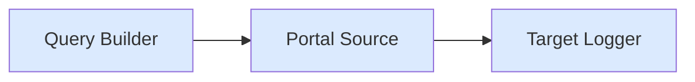
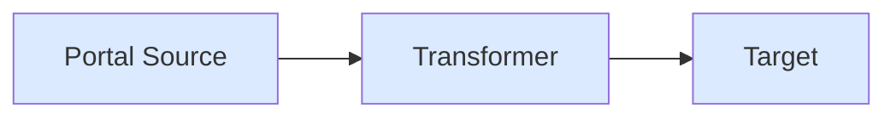
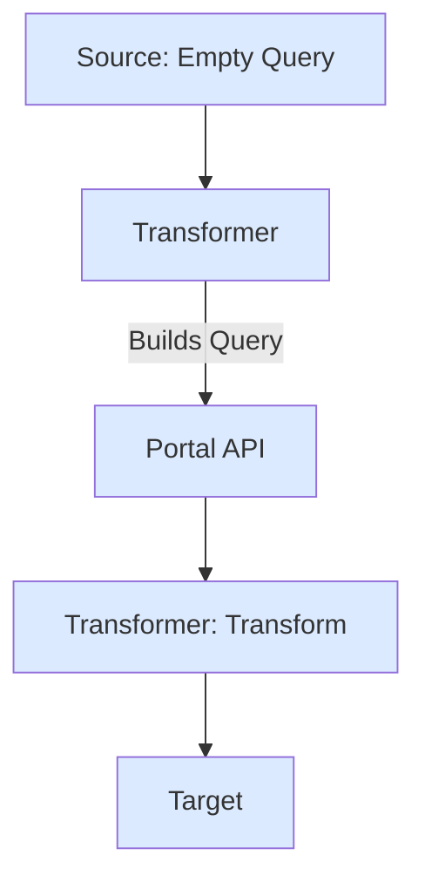

## Trivial Pipe

Stream USDC transfers from Portal to logger.

**Use case**: Basic data streaming with query builder.

```ts
import { createTarget } from "@sqd-pipes/pipes";
import { createEvmPortalSource, EvmQueryBuilder } from "@sqd-pipes/pipes/evm";

const queryBuilder = new EvmQueryBuilder()
  .addFields({
    block: { number: true, hash: true },
    log: { address: true, topics: true, data: true, transactionHash: true },
  })
  .addLog({
    request: {
      address: ["0xa0b86991c6218b36c1d19d4a2e9eb0ce3606eb48"], // USDC
      topic0: [
        "0xddf252ad1be2c89b69c2b068fc378daa952ba7f163c4a11628f55a4df523b3ef",
      ], // Transfer
    },
    range: { from: 20000000, to: 20000000 },
  });

const source = createEvmPortalSource({
  portal: "https://portal.sqd.dev/datasets/ethereum-mainnet",
  query: queryBuilder,
});

const target = createTarget({
  write: async ({ ctx: { logger }, read }) => {
    for await (const { data } of read()) {
      logger.info(data, "data");
    }
  },
});

await source.pipeTo(target);
```

### Data Flow



## Adding Transformer

Extract transaction hashes from logs.

**Use case**: Transform raw Portal data before logging.

```ts expandable
import { createTarget, createTransformer } from "@sqd-pipes/pipes";
import {
  createEvmPortalSource,
  type EvmPortalData,
  EvmQueryBuilder,
} from "@sqd-pipes/pipes/evm";

const queryBuilder = new EvmQueryBuilder()
  .addFields({
    block: { number: true, hash: true },
    log: { address: true, topics: true, data: true, transactionHash: true },
  })
  .addLog({
    request: {
      address: ["0xa0b86991c6218b36c1d19d4a2e9eb0ce3606eb48"],
      topic0: [
        "0xddf252ad1be2c89b69c2b068fc378daa952ba7f163c4a11628f55a4df523b3ef",
      ],
    },
    range: { from: 20000000, to: 20000000 },
  });

const source = createEvmPortalSource({
  portal: "https://portal.sqd.dev/datasets/ethereum-mainnet",
  query: queryBuilder,
});

const transformer = createTransformer({
  transform: async (data: EvmPortalData<any>) => {
    return data.blocks.map((b) => b.logs.map((l) => l.transactionHash));
  },
});

const target = createTarget({
  write: async ({ ctx: { logger }, read }) => {
    for await (const { data } of read()) {
      logger.info({ data }, "transaction hashes");
    }
  },
});

await source.pipe(transformer).pipeTo(target);
```

### Data Flow



## Query from Transformer

Build query dynamically in transformer.

**Use case**: Self-contained transformers that specify their own data requirements.

```ts expandable
import { createTarget, createTransformer } from "@sqd-pipes/pipes";
import {
  createEvmPortalSource,
  type EvmPortalData,
  EvmQueryBuilder,
} from "@sqd-pipes/pipes/evm";

// Start with empty query
const source = createEvmPortalSource({
  portal: "https://portal.sqd.dev/datasets/ethereum-mainnet",
  query: new EvmQueryBuilder(),
});

// Transformer adds to query
const transformer = createTransformer({
  query: ({ queryBuilder }) => {
    queryBuilder
      .addFields({
        block: { number: true, hash: true },
        log: { address: true, topics: true, data: true, transactionHash: true },
      })
      .addLog({
        request: {
          address: ["0xa0b86991c6218b36c1d19d4a2e9eb0ce3606eb48"],
          topic0: [
            "0xddf252ad1be2c89b69c2b068fc378daa952ba7f163c4a11628f55a4df523b3ef",
          ],
        },
        range: { from: 20000000, to: 20000000 },
      });
  },
  transform: async (data: EvmPortalData<any>) => {
    return data.blocks.map((b) => b.logs.map((l) => l.transactionHash));
  },
});

const target = createTarget({
  write: async ({ ctx: { logger }, read }) => {
    for await (const { data } of read()) {
      logger.info({ data }, "data");
    }
  },
});

await source.pipe(transformer).pipeTo(target);
```

### Data Flow



## Next Steps

<CardGroup cols={2}>
  <Card
    title="Event Decoding"
    icon="code"
    href="/en/sdk/pipes-sdk/examples/event-decoding"
  >
    Decode smart contract events
  </Card>

{" "}

<Card
  title="Data Persistence"
  href="/en/sdk/pipes-sdk/examples/data-persistence"
>
  Save to database
</Card>

{" "}

<Card
  title="Core Concepts"
  icon="book"
  href="/en/sdk/pipes-sdk/core-concepts/core-concepts"
>
  Learn the architecture
</Card>

  <Card title="Reference" icon="lightbulb" href="/en/sdk/pipes-sdk/reference/reference">
    API reference
  </Card>
</CardGroup>
