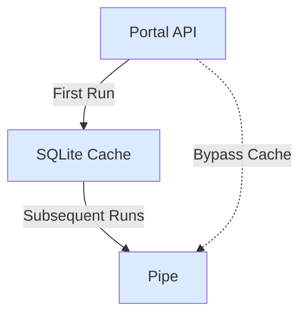

## Portal Caching

Cache Portal responses locally for faster iteration.

**Use case**: Speed up development by caching Portal data.

**Performance**: 55s first run → 35s cached run

```ts
import { createTarget } from "@sqd-pipes/pipes";
import {
  createEvmPortalSource,
  createEvmDecoder,
  commonAbis,
} from "@sqd-pipes/pipes/evm";
import { sqliteCacheAdapter } from "@sqd-pipes/pipes/portal-cache";

const source = createEvmPortalSource({
  portal: "https://portal.sqd.dev/datasets/ethereum-mainnet",
  cache: {
    adapter: await sqliteCacheAdapter({
      path: "./portal-cache.sqlite",
    }),
  },
});

const decoder = createEvmDecoder({
  profiler: { id: "Decoding" },
  contracts: ["0xa0b86991c6218b36c1d19d4a2e9eb0ce3606eb48"],
  events: { transfer: commonAbis.erc20.events.Transfer },
  range: { from: 20000000, to: 20100000 },
});

const target = createTarget({
  write: async ({ ctx: { logger }, read }) => {
    for await (const { data } of read()) {
      logger.info(`Got ${data.transfer.length} transfers`);
    }
  },
});

await source.pipe(decoder).pipeTo(target);
```

### Data Flow



## Composite Pipes

Process multiple data streams simultaneously.

**Use case**: Index multiple contracts in one pipe for better efficiency.

```ts expandable
import {
  createEvmPortalSource,
  createEvmDecoder,
  commonAbis,
  sqliteFactoryDatabase,
} from "@sqd-pipes/pipes/evm";
import * as uniswapAbi from "./abi/uniswap-v3";
import * as factoryAbi from "./abi/uniswap-v3-factory";

const source = createEvmPortalSource({
  portal: "https://portal.sqd.dev/datasets/base-mainnet",
});

const pipeline = source.pipeComposite({
  transfers: createEvmDecoder({
    range: { from: 20000000, to: 21000000 },
    contracts: ["0x..."],
    events: { transfer: commonAbis.erc20.events.Transfer },
  }),
  uniswapV3: createEvmDecoder({
    range: { from: 20000000, to: 21000000 },
    contracts: createFactory({
      address: uniswapAbi.base.mainnet.factory,
      event: factoryAbi.events.PoolCreated,
      parameter: (e) => e.pool,
      database: await sqliteFactoryDatabase({ path: "./pools.sqlite" }),
    }),
    events: { swap: uniswapAbi.events.Swap },
  }),
});

const target = createTarget({
  write: async ({ ctx: { logger }, read }) => {
    for await (const { data } of read()) {
      logger.info({
        transfers: data.transfers.transfer.length,
        swaps: data.uniswapV3.swap.length,
      });
    }
  },
});

await pipeline.pipeTo(target);
```

## Custom Logging

Integrate custom log transports for better observability.

**Use case**: Use pino-pretty or other log transports.

```ts
import pino from "pino";
import { createTarget } from "@sqd-pipes/pipes";
import {
  createEvmPortalSource,
  createEvmDecoder,
  commonAbis,
} from "@sqd-pipes/pipes/evm";

const customLogger = pino({
  transport: {
    target: "pino-pretty",
    options: {
      colorize: true,
      translateTime: "HH:MM:ss",
      ignore: "pid,hostname",
    },
  },
});

const source = createEvmPortalSource({
  portal: "https://portal.sqd.dev/datasets/ethereum-mainnet",
});

const decoder = createEvmDecoder({
  range: { from: 20000000, to: 20000100 },
  contracts: ["0xa0b86991c6218b36c1d19d4a2e9eb0ce3606eb48"],
  events: { transfer: commonAbis.erc20.events.Transfer },
});

const target = createTarget({
  write: async ({ read }) => {
    for await (const { data } of read()) {
      customLogger.info({ count: data.transfer.length }, "Processed transfers");
    }
  },
});

await source.pipe(decoder).pipeTo(target);
```

## Custom Metrics

Track performance metrics.

**Use case**: Monitor throughput and processing speed.

```ts expandable
import { createTarget } from "@sqd-pipes/pipes";
import {
  createEvmPortalSource,
  createEvmDecoder,
  commonAbis,
} from "@sqd-pipes/pipes/evm";

const metrics = {
  blocksProcessed: 0,
  eventsDecoded: 0,
  startTime: Date.now(),
  lastLogTime: Date.now(),
};

const source = createEvmPortalSource({
  portal: "https://portal.sqd.dev/datasets/ethereum-mainnet",
});

const decoder = createEvmDecoder({
  range: { from: 20000000, to: 21000000 },
  contracts: ["0xa0b86991c6218b36c1d19d4a2e9eb0ce3606eb48"],
  events: { transfer: commonAbis.erc20.events.Transfer },
});

const target = createTarget({
  write: async ({ ctx: { profiler, logger }, read }) => {
    for await (const { data } of read()) {
      const span = profiler.start("processing");

      // Update metrics
      metrics.eventsDecoded += data.transfer.length;
      metrics.blocksProcessed += 1;

      // Log every 5 seconds
      const now = Date.now();
      if (now - metrics.lastLogTime > 5000) {
        const elapsed = (now - metrics.startTime) / 1000;
        const eventsPerSec = metrics.eventsDecoded / elapsed;
        const blocksPerSec = metrics.blocksProcessed / elapsed;

        logger.info({
          blocks: metrics.blocksProcessed,
          events: metrics.eventsDecoded,
          bps: blocksPerSec.toFixed(2),
          eps: eventsPerSec.toFixed(2),
        });

        metrics.lastLogTime = now;
      }

      await processData(data);
      span.end();
    }
  },
});

await source.pipe(decoder).pipeTo(target);
```

## Indexing Latency

Measure time from block production to indexing.

**Use case**: Track real-time indexing performance.

```ts expandable
import { createTarget } from "@sqd-pipes/pipes";
import {
  createEvmPortalSource,
  createEvmDecoder,
  commonAbis,
} from "@sqd-pipes/pipes/evm";

const source = createEvmPortalSource({
  portal: "https://portal.sqd.dev/datasets/ethereum-mainnet",
});

const decoder = createEvmDecoder({
  range: { from: "latest" },
  contracts: ["0xa0b86991c6218b36c1d19d4a2e9eb0ce3606eb48"],
  events: { transfer: commonAbis.erc20.events.Transfer },
});

const latencies: number[] = [];

const target = createTarget({
  write: async ({ ctx: { logger }, read }) => {
    for await (const { data } of read()) {
      for (const transfer of data.transfer) {
        const blockTime = transfer.timestamp.getTime();
        const now = Date.now();
        const latency = now - blockTime;

        latencies.push(latency);

        if (latencies.length % 100 === 0) {
          const avg = latencies.reduce((a, b) => a + b, 0) / latencies.length;
          const min = Math.min(...latencies);
          const max = Math.max(...latencies);

          logger.info({
            avgLatencyMs: avg.toFixed(0),
            avgLatencySec: (avg / 1000).toFixed(2),
            minSec: (min / 1000).toFixed(2),
            maxSec: (max / 1000).toFixed(2),
            samples: latencies.length,
          });
        }
      }
    }
  },
});

await source.pipe(decoder).pipeTo(target);
```

## ClickHouse Batching

Optimize ClickHouse inserts with batching.

**Use case**: Maximize ClickHouse insert performance.

```ts expandable
import { createClient } from "@clickhouse/client";
import {
  createEvmPortalSource,
  createEvmDecoder,
  commonAbis,
} from "@sqd-pipes/pipes/evm";
import { createClickhouseTarget } from "@sqd-pipes/pipes/targets/clickhouse";

const client = createClient({
  username: "default",
  password: "default",
  url: "http://localhost:8123",
});

await client.command({
  query: `
    CREATE TABLE IF NOT EXISTS usdc_transfers (
      block_number UInt32 CODEC (DoubleDelta, ZSTD),
      timestamp DateTime CODEC (DoubleDelta, ZSTD),
      transaction_hash String,
      log_index UInt16,
      from_address LowCardinality(FixedString(42)),
      to_address LowCardinality(FixedString(42)),
      value UInt256,
      sign Int8 DEFAULT 1
    )
    ENGINE = CollapsingMergeTree(sign)
    ORDER BY (block_number, transaction_hash, log_index)
  `,
});

const source = createEvmPortalSource({
  portal: "https://portal.sqd.dev/datasets/ethereum-mainnet",
});

const decoder = createEvmDecoder({
  range: { from: 20000000, to: 21000000 },
  contracts: ["0xa0b86991c6218b36c1d19d4a2e9eb0ce3606eb48"],
  events: { transfer: commonAbis.erc20.events.Transfer },
});

const target = createClickhouseTarget({
  client,
  onData: async ({ store, data, ctx }) => {
    const span = ctx.profiler.start("clickhouse-insert");

    ctx.logger.info(`Inserting ${data.transfer.length} transfers`);

    store.insert({
      table: "usdc_transfers",
      values: data.transfer.map((t) => ({
        block_number: t.blockNumber,
        timestamp: t.timestamp.valueOf() / 1000,
        transaction_hash: t.transactionHash,
        log_index: t.rawEvent.logIndex,
        from_address: t.event.from,
        to_address: t.event.to,
        value: t.event.value.toString(),
      })),
      format: "JSONEachRow",
    });

    span.end();
  },
  onRollback: async ({ store, cursor }) => {
    await store.removeAllRows({
      tables: ["usdc_transfers"],
      where: `block_number > ${cursor.number}`,
    });
  },
});

await source.pipe(decoder).pipeTo(target);
```

## Profiler Usage

Use built-in profiler to identify bottlenecks.

**Use case**: Measure and optimize specific pipe stages.

```ts
import { createTarget } from "@sqd-pipes/pipes";
import {
  createEvmPortalSource,
  createEvmDecoder,
  commonAbis,
} from "@sqd-pipes/pipes/evm";

const source = createEvmPortalSource({
  portal: "https://portal.sqd.dev/datasets/ethereum-mainnet",
});

const decoder = createEvmDecoder({
  profiler: { id: "ERC20 Decoding" },
  range: { from: 20000000, to: 20000100 },
  contracts: ["0xa0b86991c6218b36c1d19d4a2e9eb0ce3606eb48"],
  events: { transfer: commonAbis.erc20.events.Transfer },
});

const target = createTarget({
  write: async ({ ctx: { profiler, logger }, read }) => {
    for await (const { data } of read()) {
      const transformSpan = profiler.start("transform");
      const transformed = data.transfer.map((t) => ({
        from: t.event.from,
        to: t.event.to,
        value: t.event.value.toString(),
      }));
      transformSpan.end();

      const saveSpan = profiler.start("database-save");
      await database.insertBatch(transformed);
      saveSpan.end();

      logger.info(`Processed ${transformed.length} transfers`);
    }
  },
});

await source.pipe(decoder).pipeTo(target);
```

### Profile Output

```
ERC20 Decoding: 1.2s
transform: 0.3s
database-save: 0.8s
```

## Next Steps

<CardGroup cols={2}>
  <Card
    title="Advanced Patterns"
    icon="rocket"
    href="/en/sdk/pipes-sdk/integration-advanced/advanced-patterns"
  >
    More optimization patterns
  </Card>

{" "}

<Card
  title="ClickHouse"
  href="/en/sdk/pipes-sdk/integration-advanced/clickhouse-integration"
>
  ClickHouse optimization
</Card>

{" "}

<Card
  title="Factory Pattern"
  icon="industry"
  href="/en/sdk/pipes-sdk/examples/factory-pattern"
>
  Factory optimization
</Card>

  <Card title="Reference" icon="book" href="/en/sdk/pipes-sdk/reference/reference">
    API reference
  </Card>
</CardGroup>
