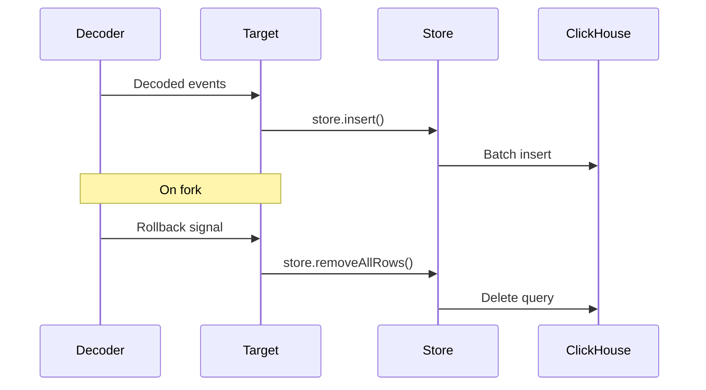

## Install Client

```bash
npm install @clickhouse/client
```

## createClickhouseTarget

ClickHouse target with automatic cursor management.

```ts
import { createClient } from "@clickhouse/client";
import { createClickhouseTarget } from "@sqd-pipes/pipes/targets/clickhouse";

const client = createClient({
  username: "default",
  password: "default",
  url: "http://localhost:8123",
});

const target = createClickhouseTarget({
  client,
  onData: async ({ store, data, ctx }) => {
    store.insert({
      table: "transfers",
      values: data.transfer.map((t) => ({
        block_number: t.blockNumber,
        timestamp: t.timestamp.valueOf() / 1000,
        transaction_hash: t.transactionHash,
        from_address: t.event.from,
        to_address: t.event.to,
        value: t.event.value.toString(),
      })),
      format: "JSONEachRow",
    });
  },
  onRollback: async ({ store, cursor }) => {
    await store.removeAllRows({
      tables: ["transfers"],
      where: `block_number > ${cursor.number}`,
    });
  },
});

await source.pipe(decoder).pipeTo(target);
```

## Create Table

```sql
CREATE TABLE IF NOT EXISTS transfers (
  block_number          UInt32 CODEC (DoubleDelta, ZSTD),
  timestamp             DateTime CODEC (DoubleDelta, ZSTD),
  transaction_hash      String,
  log_index             UInt16,
  from_address          LowCardinality(FixedString(42)),
  to_address            LowCardinality(FixedString(42)),
  value                 UInt256,
  sign                  Int8 DEFAULT 1
)
ENGINE = CollapsingMergeTree(sign)
ORDER BY (block_number, transaction_hash, log_index);
```

Run with client:

```ts
await client.command({
  query: `
    CREATE TABLE IF NOT EXISTS transfers (
      block_number UInt32 CODEC (DoubleDelta, ZSTD),
      timestamp DateTime CODEC (DoubleDelta, ZSTD),
      transaction_hash String,
      log_index UInt16,
      from_address LowCardinality(FixedString(42)),
      to_address LowCardinality(FixedString(42)),
      value UInt256,
      sign Int8 DEFAULT 1
    )
    ENGINE = CollapsingMergeTree(sign)
    ORDER BY (block_number, transaction_hash, log_index)
  `,
});
```

## onData

Insert data with store helper:

```ts
onData: async ({ store, data, ctx }) => {
  const { logger, profiler } = ctx;
  const span = profiler.start("insert");

  logger.info(`Inserting ${data.transfer.length} transfers`);

  store.insert({
    table: "transfers",
    values: data.transfer.map((t) => ({
      block_number: t.blockNumber,
      timestamp: t.timestamp.valueOf() / 1000,
      transaction_hash: t.transactionHash,
      log_index: t.rawEvent.logIndex,
      from_address: t.event.from,
      to_address: t.event.to,
      value: t.event.value.toString(),
    })),
    format: "JSONEachRow",
  });

  span.end();
};
```

### Store Methods

**store.insert()** - Queue insert:

```ts
store.insert({
  table: 'transfers',
  values: [...],
  format: 'JSONEachRow'
})
```

**store.removeAllRows()** - Delete rows:

```ts
await store.removeAllRows({
  tables: ["transfers"],
  where: `block_number > ${cursor.number}`,
});
```

## onRollback

Handle blockchain forks:

```ts
onRollback: async ({ store, cursor, type }) => {
  console.log(`Fork at block ${cursor.number}`);

  try {
    await store.removeAllRows({
      tables: ["transfers"],
      where: `block_number > ${cursor.number}`,
    });
  } catch (err) {
    console.error("Rollback failed:", err);
    throw err;
  }
};
```

## Complete Example

```ts expandable
import { createClient } from "@clickhouse/client";
import {
  createEvmPortalSource,
  createEvmDecoder,
  commonAbis,
} from "@sqd-pipes/pipes/evm";
import { createClickhouseTarget } from "@sqd-pipes/pipes/targets/clickhouse";

// Create ClickHouse client
const client = createClient({
  username: "default",
  password: "default",
  url: "http://localhost:8123",
});

// Create table
await client.command({
  query: `
    CREATE TABLE IF NOT EXISTS usdc_transfers (
      block_number UInt32 CODEC (DoubleDelta, ZSTD),
      timestamp DateTime CODEC (DoubleDelta, ZSTD),
      transaction_hash String,
      log_index UInt16,
      from_address LowCardinality(FixedString(42)),
      to_address LowCardinality(FixedString(42)),
      value UInt256,
      sign Int8 DEFAULT 1
    )
    ENGINE = CollapsingMergeTree(sign)
    ORDER BY (block_number, transaction_hash, log_index)
  `,
});

// Create source
const source = createEvmPortalSource({
  portal: "https://portal.sqd.dev/datasets/ethereum-mainnet",
});

// Create decoder
const decoder = createEvmDecoder({
  range: { from: "latest" },
  contracts: ["0xa0b86991c6218b36c1d19d4a2e9eb0ce3606eb48"],
  events: {
    transfer: commonAbis.erc20.events.Transfer,
  },
});

// Create target
const target = createClickhouseTarget({
  client,
  onData: async ({ store, data, ctx }) => {
    console.log(`Inserting ${data.transfer.length} transfers`);

    store.insert({
      table: "usdc_transfers",
      values: data.transfer.map((t) => ({
        block_number: t.blockNumber,
        timestamp: t.timestamp.valueOf() / 1000,
        transaction_hash: t.transactionHash,
        log_index: t.rawEvent.logIndex,
        from_address: t.event.from,
        to_address: t.event.to,
        value: t.event.value.toString(),
      })),
      format: "JSONEachRow",
    });
  },
  onRollback: async ({ store, cursor }) => {
    await store.removeAllRows({
      tables: ["usdc_transfers"],
      where: `block_number > ${cursor.number}`,
    });
  },
});

// Run pipeline
await source.pipe(decoder).pipeTo(target);
```

## Table Design

### Recommended Engine

Use `CollapsingMergeTree` for fork handling:

```sql
ENGINE = CollapsingMergeTree(sign)
ORDER BY (block_number, transaction_hash, log_index)
```

### Codecs

Use compression codecs:

```sql
block_number UInt32 CODEC (DoubleDelta, ZSTD),
timestamp DateTime CODEC (DoubleDelta, ZSTD)
```

### Address Storage

Use `LowCardinality` for repeated values:

```sql
from_address LowCardinality(FixedString(42))
```

### BigInt Values

Store as String:

```sql
value UInt256
-- or
value String  -- for very large numbers
```

## Data Flow



## Querying Data

```sql
-- Recent transfers
SELECT * FROM transfers
ORDER BY block_number DESC
LIMIT 100;

-- Top senders
SELECT
  from_address,
  count() as transfer_count,
  sum(value) as total_value
FROM transfers
GROUP BY from_address
ORDER BY total_value DESC
LIMIT 10;

-- Daily volume
SELECT
  toDate(timestamp) as date,
  count() as transfer_count,
  sum(value) / 1e6 as total_usdc
FROM transfers
GROUP BY date
ORDER BY date;
```

## Docker Setup

```yaml docker-compose.yml
version: "3.8"

services:
  clickhouse:
    image: clickhouse/clickhouse-server:latest
    ports:
      - "8123:8123"
      - "9000:9000"
    environment:
      CLICKHOUSE_DB: default
      CLICKHOUSE_USER: default
      CLICKHOUSE_PASSWORD: default
    volumes:
      - clickhouse-data:/var/lib/clickhouse

volumes:
  clickhouse-data:
```

Start:

```bash
docker compose up -d
```

## Next Steps

<CardGroup cols={2}>
  <Card
    title="Advanced Patterns"
    icon="rocket"
    href="/en/sdk/pipes-sdk/integration-advanced/advanced-patterns"
  >
    Advanced techniques
  </Card>

{" "}

<Card
  title="Examples"
  icon="lightbulb"
  href="/en/sdk/pipes-sdk/examples/data-persistence"
>
  Persistence examples
</Card>

  <Card title="Reference" icon="book" href="/en/sdk/pipes-sdk/reference/reference">
    Full API reference
  </Card>
</CardGroup>
